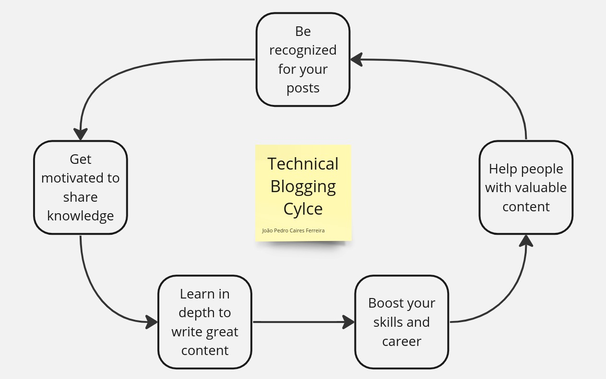

+++
title = 'How Blogging Can Leverage Your Tech Career'
date = 2024-03-05T20:35:51-03:00
draft = false
+++

### You Better Read
Reading is important in technology. Documentation, blog posts and articles are the gold mine for learning advanced content, and blogging is a chill way for tech wizards who'd rather type than talk on camera to share their wisdom. Tech has this cool vibe where people love creating content, especially on their own blog or platforms like Dev.to.

This cycle represents how it works and I'm a big believer in the whole tech blogging community as a mutual collaboration environment. If you want to boost your tech career outside your work, a blog can be a good suggestion and I'll tell you why here.

### Why Tech Blogging
##### Stands you out
Blogging sets you apart in the tech crowd. It's like your personal brand and signature that catches people's eyes.

##### Makes you a technical reference
When you blog, you become the go-to person for tech insights. You're the reference guide others look up to.

##### Forces you to know about in depth
Writing about tech forces you to dig deep and this is challenging. Push hard until you master the domain.

##### Gives you organic reach
Blogging puts your ideas out there. You'll be surprised how far your thoughts can travel.

##### Great notes to study
Your blog becomes your personal tech notebook of learning and experiences, ready to be revisited anytime.

##### Improve your communication
Expressing tech concepts in a blog teaches you how to simplify complexity and connect with a broader audience.

### My Inspiration For Blogging

One of my best technical references is [Vlad Mihalcea](https://vladmihalcea.com/). Recentely, he shared a [thougth on LinkedIn](https://www.linkedin.com/posts/vladmihalcea_blogging-has-helped-me-write-much-better-activity-7169260719308267521-KdPc) that was the trigger to start this blog. I also have many other blogging inspirations and if I deep dive into these reasons above, it could fill an entire book. I hope this helps you in your career someway.
