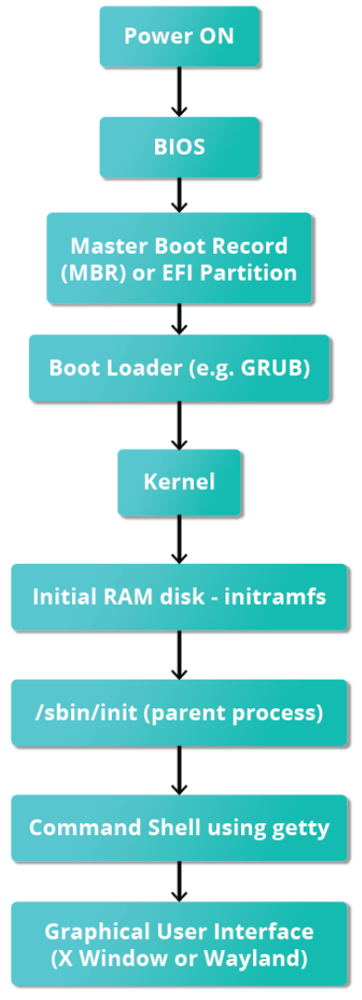
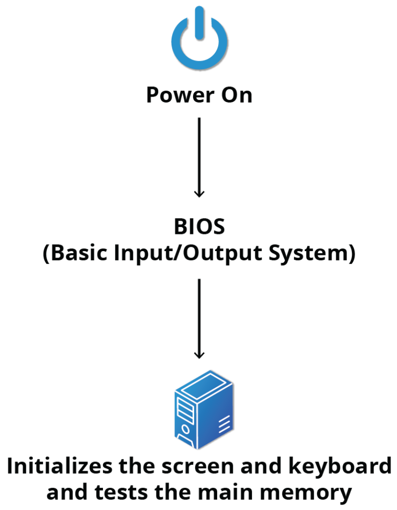
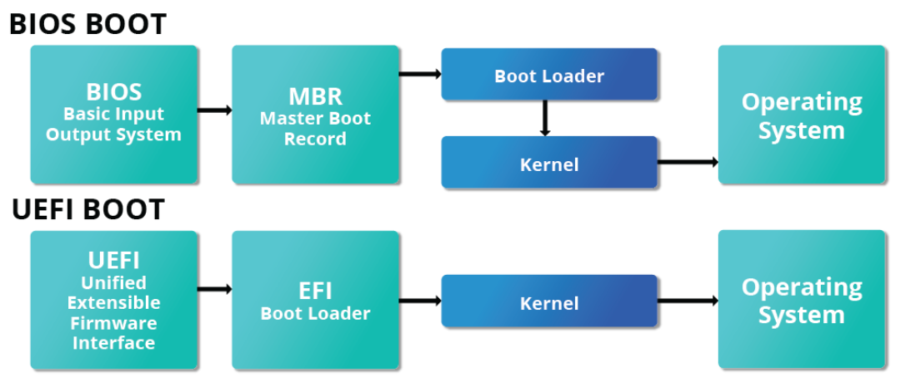
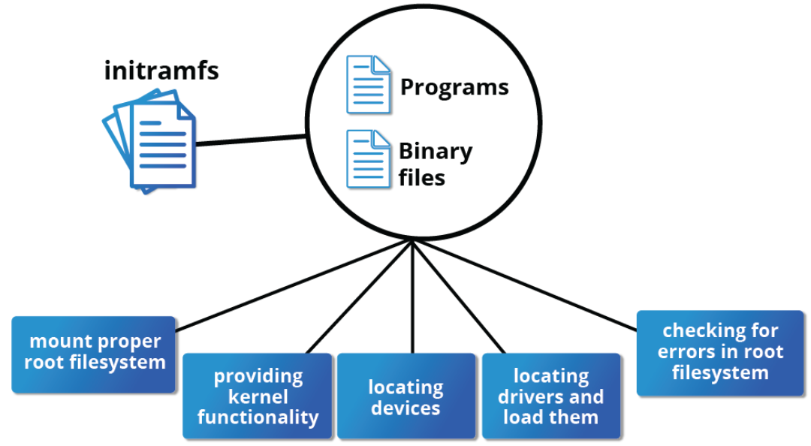
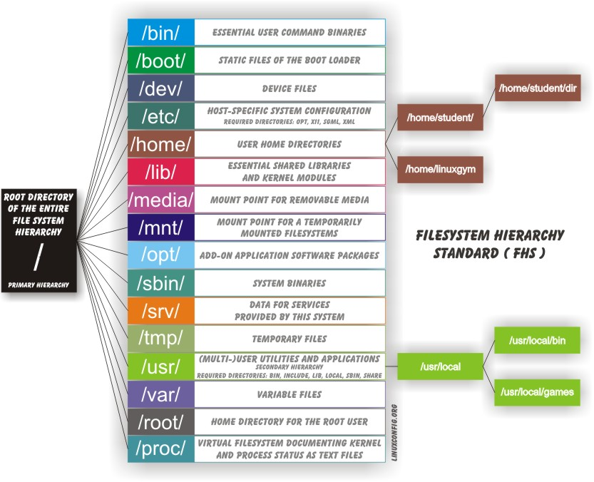

    +++
    title = "Understanding the Linux Boot Process"
    date = 2024-09-22T20:35:51-03:00
    draft = false
    +++
    
    When you turn on your computer, several steps happen before you can use your operating system. In this post, I’ll explain the Linux boot process in a simple way. Most of the content is based on the [Introduction to Linux course, from The Linux Foundation](https://training.linuxfoundation.org/training/introduction-to-linux/) which I did and highly recommend (free course, only pays for certificate).
    
    > **_TL;DR:_** When your computer starts, the BIOS/UEFI runs, GRUB loads the Linux kernel, and systemd takes over to start services and the user interface.
    
    ---
    
    ### Why understanding the boot process
    
    One reason Linux is considered more secure than other systems is because each program runs in isolation. This means that a virus or malicious program has a harder time spreading. In Linux, each process (or task) has its own set of resources and permissions. If something bad happens in one process, it won’t easily affect the others.
    
    Understanding how Linux boots helps you troubleshoot problems and customize your system, giving you more control over your computer.
    
    
    
    ### Step 1: BIOS, UEFI, and Boot Loader
    
    **BIOS** (Basic Input/Output System) is a small program stored on your computer's motherboard. It checks if your hardware (like the keyboard and monitor) is working when you turn the computer on. Newer computers use **UEFI** (Unified Extensible Firmware Interface), which is a more advanced version of BIOS.
    
    
    
    After the hardware check, the BIOS/UEFI looks for a bootable partition on your hard drive or USB stick. This partition has a **/boot/efi** directory that contains the **boot loader**, a program that starts your operating system. 
        
    
    
    The second stage boot loader resides under **/boot**. For Linux, the boot loader is usually **GRUB** (GRand Unified Bootloader). GRUB has a configuration that tells it where the **kernel** and **initramfs** (initial RAM filesystem) are located. GRUB loads both the kernel and initramfs into memory and decompresses them.
        
    ### Step 2: Kernel and Initramfs
    
    The **kernel** is the core part of an operating system. Once the kernel is loaded, it takes over control and uses initramfs as a temporary file system. It manages how software and hardware work together. In Linux, the kernel is usually compressed in a file called **vmlinuz**.
    
    When GRUB loads the kernel, it also mounts a temporary partition in RAM called **initramfs**. Initramfs contains important drivers and tools that help the system complete the boot process.
    
    After the kernel is loaded and decompressed, it mounts the real root file system (usually located in **/**), and the boot process can continue.
    
    
    
    The **/proc** directory holds virtual files that provide information about the system and kernel. These aren't actual files but represent real-time data, like system memory, mounted devices, and hardware details. It's a key place for checking how your system is running behind the scenes.
    
    
    
    ### Step 3: Systemd and Runlevels
    
    Once the kernel is ready, it runs **/sbin/init** and starts a program called **systemd**. Systemd is a service manager that runs as process 1. It controls all the other programs and services on your computer.
    
    Before systemd, Linux used another program called **init**. This process controlled the **runlevels**, which defined which services or programs were running at different stages of the boot process. For example:
    
    - **Runlevel 0**: System is off
    - **Runlevel 1**: Single-user mode, used for system recovery
    - **Runlevel 2**: Multi-user mode without Network File System (NFS)
    - **Runlevel 3**: Multi-user mode with a command line
    - **Runlevel 4**: User-definable
    - **Runlevel 5**: Multi-user mode with a graphical interface (GUI)
    - **Runlevel 6**: Reboot the system
    
    Nowadays, systemd uses **targets** as an equivalent to runlevels. These targets decide which services to start based on the current system state. For example, `graphical.target` is similar to runlevel 5 (GUI mode), and `multi-user.target` is similar to runlevel 3 (command-line mode).
    
    You can manually change the runlevel by using:
    
    ```bash
    sudo telinit {runlevel number}
    ```
